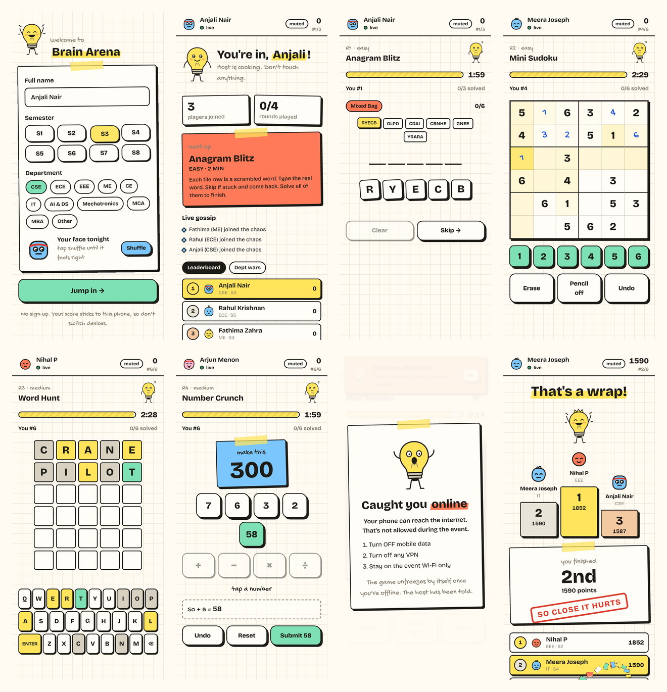
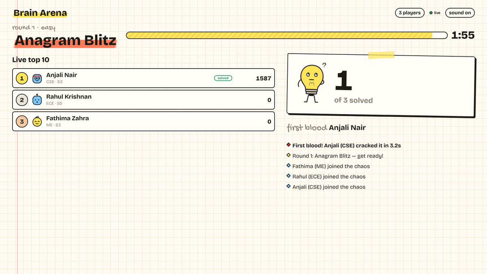
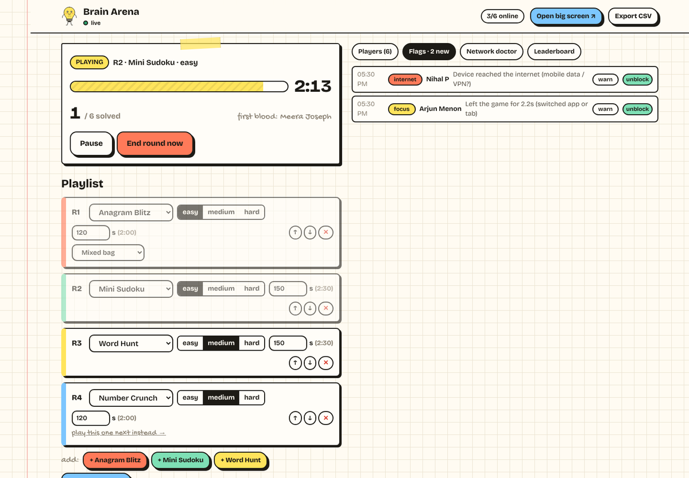

# Brain Arena · IEDC Hub Tournaments

Live, offline, tournament-style logic games for college events.

The host taps **Start** and every connected phone gets the same puzzle at the same moment. Speed and correctness feed a live leaderboard that every device can see, along with a department-vs-department board. It all runs on **one laptop's Wi-Fi hotspot with no internet**, so nobody can ask an AI for the answer.



| Big screen (projector) | Host console |
|---|---|
|  |  |

---

## What's inside

**Games**, all generated from a seed and checked on the server. Each has an easy, medium and hard level.

| Game | What students do | Fairness |
|---|---|---|
| **Anagram Blitz** | Unscramble 6–8 words from themed packs (Tech, Campus, Food, Science), or from the host's own custom words | Dictionary anagrams also count (*notes* → *stone*) |
| **Mini Sudoku** | 6×6 (easy and medium) or 9×9 (hard), with pencil marks, undo and conflict highlighting | Every puzzle has exactly one solution |
| **Word Hunt** | Wordle-style: 5 letters, 6 tries, the same word for everyone | Colours are computed on the server, so the word never reaches phones |
| **Number Crunch** | Reach the target with + − × ÷ by tapping tiles, Countdown style | Every target is guaranteed reachable |

**Scoring:**
- Solve: 1000 × difficulty.
- Speed bonus: up to +500.
- **First blood**: +100.
- Wrong Sudoku check: −25.
- Partial credit (up to 300) when time runs out.
- Ties go to whoever was faster overall.

**Formats:** *Classic* (total points) and *Knockout* (the bottom X% is out after each round and spectates).

**Every device sees the leaderboard:**
- **During a round:** a live rank strip plus the top 10 after you finish.
- **Between rounds:** the answer reveal, round results, the full leaderboard with your row pinned, and **Dept wars**.
- **At the end:** a podium with funny titles ("So Close It Hurts", "Vibes Only", …).

**Anti-cheat:**
- **Internet probe:** if a phone can reach the internet (mobile data or a VPN), play freezes until it can't, and the host is told.
- **Leaving the game:** leaving for more than 1.5 s mid-round is a strike. Strikes go warn → −200 → round lock.
- **Server-side answers:** answers are only ever on the laptop. Copying and long-press menus are disabled in games.

**Student ID + PIN:**
- Students join with full name, Student ID (or admission / roll no., up to 10 characters), semester and department.
- On the next screen they create a 4-digit PIN the first time, or enter it later. There's no "forgot PIN"; the browser offers to save it.
- The same Student ID on another phone (with the right PIN) continues with the same score.
- PINs are scrypt-hashed on the laptop; 5 wrong tries lock the ID for 10 minutes. The host can unlock or reset a PIN from the **Students** tab.

**Monthly leaderboard** (`/leaderboard`):
- Every tournament is recorded on the laptop when the host shows the podium. The **Monthly** tab lets the host include/exclude, rename or delete them.
- Points add up per Student ID across the month; this month and previous months are shown, with a "Last updated" time.
- On the event Wi-Fi the page is live from the laptop. Online it shows `data/leaderboard/monthly.json`: download it from the Monthly tab, commit, push, and Vercel rebuilds ([how](data/README.md#publishing-the-monthly-leaderboard)). No Student IDs are published.

**Host console:**
- Playlist builder.
- Start, pause, end round, podium.
- Kick, unblock or adjust points.
- Cheat-flag feed.
- **Network doctor**: QR per network, players per IP, and a warning if the laptop itself has internet.
- CSV export.

**Robustness:**
- **Crash safety:** snapshots and an event log on disk. Restart and everything is restored.
- **Clock sync:** clocks are synced to the server, so countdowns line up.
- **Reconnects:** phones rejoin on reconnect with their device token, and a duplicate tab gets bumped.

**Design:** a "back-bench notebook" look:
- graph paper and marker outlines,
- sticker buttons and taped paper slips,
- highlighter accents,
- *Bulbu*, the doodled lightbulb who sweats when the timer runs low,
- doodle avatars made from 2,250 combinations,
- sounds synthesised in the browser, with no audio files.

---

## Changing text and settings

All wording (titles, descriptions, buttons, funny messages), the department list, scoring numbers, timings and word lists live in **[`data/`](data/README.md)**. Edit a file there and every screen updates. No app code to touch. `data/README.md` has a "change X → edit file Y" table.

---

## Running an event

👉 **Read [docs/EVENT_DAY.md](docs/EVENT_DAY.md)**. It's the checklist for hosts.

Short version (Windows laptop):

1. `pnpm pack:arena` on a dev machine, then copy `dist/brain-arena/` to the laptop. The laptop only needs Node.js 20+.
2. Once, as admin: run **`setup-hotspot.ps1`**. It raises the Mobile Hotspot limit to **128** (`WifiMaxPeers`), keeps the hotspot awake, opens the firewall and sets up the loopback adapter, so the hotspot has no internet.
3. On the day, double-click **`start-arena.bat`**. It turns on the hotspot and starts the server.
4. Students join the Wi-Fi and open **`http://192.168.137.1:4000`** (the address never changes, so print the QR).
5. Host: `http://localhost:4000/host/` (the PIN is in the terminal). Projector: `http://localhost:4000/screen/`.

For more phones than the laptop's Wi-Fi card can handle, you can add *Wi-Fi sharing* repeater phones (same URL) or USB Wi-Fi dongles (one QR per network). The guide covers both.

---

## Deploy the online site (Vercel)

The web app is a static export, so Vercel can host the **online half**: the landing page, solo practice and the installable PWA. Live events still run on the laptop. Vercel can't host the arena server, because it needs a long-running WebSocket process.

1. In Vercel, choose **Add New → Project** and import `ajayda24/iedc-hub-tournaments`.
2. Set **Root Directory** to `apps/web` and leave "Include files outside the root directory" on. Everything else comes from `apps/web/vercel.json`: a pnpm workspace install, `next build --webpack` and output `out/`, deployed as a plain static site (framework "Other").
3. If an old deploy fails with `routes-manifest.json couldn't be found`, set **Settings → Build & Deployment → Framework Preset** to **Other** and redeploy.
4. No environment variables are needed. Every push to `main` redeploys.

---

## Development

```bash
pnpm install
pnpm dev            # arena on :4000 + Next dev server on :3000
                    # open http://localhost:3000/host/ (PIN printed by the arena), /screen/, /play/
pnpm test           # engine + arena unit tests (Vitest)
pnpm build          # static web export (apps/web/out, precompressed) + arena bundle
pnpm start          # arena serving the built app on :4000
pnpm test:e2e       # Playwright: real arena + browsers (needs `pnpm build` first)
pnpm bots --n 80    # 80 simulated students who actually solve puzzles (dry run / load test)
pnpm pack:arena     # dist/brain-arena: single-folder build for the event laptop
```

Measured locally with `pnpm bots --n 80` over four rounds:
- the arena process used **~2% CPU and ~140 MB RAM**,
- the leaderboard reflected a submit after **p50 ~300 ms / p95 < 500 ms** (updates are throttled to 2 per second),
- first load on a phone is about **165 KB of gzipped JS**, and game screens are split into their own chunks.

### Layout

```
data              ALL text, labels, constants and word lists (edit here)
packages/shared   protocol types, zod schemas, seeded RNG, scoring, the 4 game engines (+ tests)
apps/arena        Fastify + Socket.IO server: Arena state machine, anti-cheat, persistence, network info
apps/web          Next.js (App Router, static export) + Serwist PWA: /play /host /screen /practice /leaderboard
scripts           precompress, pack-arena, Windows hotspot scripts
e2e               Playwright end-to-end tests
docs              EVENT_DAY.md, screenshots
```

### How it works

- **Same build, two homes.**
  - **Online** (e.g. Vercel): the landing page, solo **practice** that works offline once installed, and content updates through the service worker.
  - **At the event:** the laptop serves the same static files over plain `http` on the LAN, so phones need nothing pre-installed.
  - The installed online PWA links across to the LAN URL instead of connecting directly. Browsers block `ws://` from `https` pages, and service workers need HTTPS.
- **Server-authoritative rounds.**
  - Puzzles are generated with a fresh seed when the host starts a round.
  - Players only get the public part, and only once the countdown ends.
  - Every move is checked and timestamped by the arena.
- **Adding a game.**
  - Write an engine that implements `GameDefinition` in `packages/shared/src/games/<id>/engine.ts`: `generate`, `check`, `partialCredit`, `reveal`.
  - Add metadata to `games/meta.ts`.
  - Add a view in `apps/web/src/games/`.
  - Register it in the two registries.
- **Content.** All text and constants live in `data/` (see above). Word lists come from the MIT [`word-list`](https://github.com/sindresorhus/word-list) package. Edit `data/words/wordhunt-answers.txt` or `data/words/anagram-packs.source.json`, then run `pnpm content:build`.

---

## Roadmap ideas

**More games:**
- **Emoji Rebus**: guess the movie from emojis, very funny on a projector.
- **Code Breaker**: Mastermind-style.
- **Odd One Out** quick-fire.
- **Memory Flash.**
- **Lights Out.**
- **Mini Nonogram.**
- **Sequence Sniper**: what comes next.
- **Riddle Rush.**
- **Reaction trap**: "don't tap red".

**Spice:**
- power-ups (*Freeze* the top 3 for 3 s, *Hint*),
- team relay rounds,
- spectator reactions flying across the big screen,
- PDF winner certificates.

**Platform:**
- an online mode,
- syncing the monthly leaderboard automatically (a database instead of a committed file),
- a daily puzzle,
- a satellite-relay mode (`--upstream`) for a second laptop,
- an Android host app.

## Known limits

- A web page can *detect* internet and freeze play, but it can't switch off a phone's mobile data. It also can't see a second phone or a friend helping. Walk around!
- Wake Lock (keeping screens on) needs HTTPS, so it isn't available on the LAN. Ask students to raise their screen timeout.
- The 128-peer registry setting is Windows' cap. The laptop's Wi-Fi card decides the real number, so do a dry run.
- `setup-hotspot.ps1` / `start-hotspot.ps1` are written for Windows 10/11 and need a quick test on your laptop.
